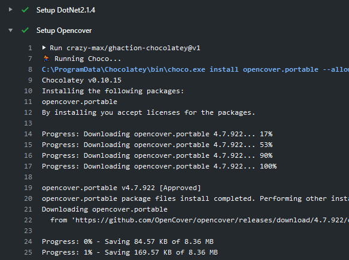

[](https://github.com/crazy-max/ghaction-chocolatey/releases/latest)
[](https://github.com/marketplace/actions/chocolatey-action)
[](https://github.com/crazy-max/ghaction-chocolatey/actions?workflow=ci)
[](https://github.com/sponsors/crazy-max)
[](https://www.paypal.me/crazyws)

## About

GitHub Action for [Chocolatey](https://chocolatey.org/), the package manager for Windows.

If you are interested, [check out](https://git.io/Je09Y) my other :octocat: GitHub Actions!



___

* [Usage](#usage)
* [Customizing](#customizing)
  * [inputs](#inputs)
* [Keep up-to-date with GitHub Dependabot](#keep-up-to-date-with-github-dependabot)
* [Limitation](#limitation)
* [How can I help?](#how-can-i-help)
* [License](#license)

## Usage

```yaml
on: push

jobs:
  test:
    runs-on: windows-latest
    steps:
      -
        name: Checkout
        uses: actions/checkout@v2
      -
        name: Choco help
        uses: crazy-max/ghaction-chocolatey@v1
        with:
          args: -h
```

## Customizing

### inputs

Following inputs can be used as `step.with` keys

| Name            | Type    | Description                     |
|-----------------|---------|---------------------------------|
| `args`          | String  | Arguments to pass to Chocolatey |
| `image`         | String  | Docker image to use (default `ghcr.io/crazy-max/ghaction-chocolatey`) |

## Keep up-to-date with GitHub Dependabot

Since [Dependabot](https://docs.github.com/en/github/administering-a-repository/keeping-your-actions-up-to-date-with-github-dependabot)
has [native GitHub Actions support](https://docs.github.com/en/github/administering-a-repository/configuration-options-for-dependency-updates#package-ecosystem),
to enable it on your GitHub repo all you need to do is add the `.github/dependabot.yml` file:

```yaml
version: 2
updates:
  # Maintain dependencies for GitHub Actions
  - package-ecosystem: "github-actions"
    directory: "/"
    schedule:
      interval: "daily"
```

## Limitation

This action is only available for Linux and Windows
[virtual environments](https://help.github.com/en/articles/virtual-environments-for-github-actions#supported-virtual-environments-and-hardware-resources).

## How can I help?

All kinds of contributions are welcome :raised_hands:! The most basic way to show your support is to star :star2:
the project, or to raise issues :speech_balloon: You can also support this project by
[**becoming a sponsor on GitHub**](https://github.com/sponsors/crazy-max) :clap: or by making
a [Paypal donation](https://www.paypal.me/crazyws) to ensure this journey continues indefinitely! :rocket:

Thanks again for your support, it is much appreciated! :pray:

## License

MIT. See `LICENSE` for more details.
